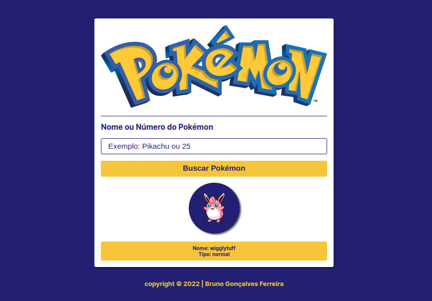

# Pokedex

> Descrição

Projeto construido com o objetivo em simular o pokedex do famoso desenho Japonês POKÉMON, conseguimos funcionar o projeto com API "https://pokeapi.co/".

  <a href="#-tecnologias">Tecnologias</a>&nbsp;&nbsp;&nbsp;|&nbsp;&nbsp;&nbsp;
  <a href="#-projeto">Projeto</a>&nbsp;&nbsp;&nbsp;|&nbsp;&nbsp;&nbsp;
 

 

[Clique aqui para acessar](https://brunogoncalvesferreira.github.io/app-find-pokemon/)

 

## 🚀 Tecnologias

Esse projeto foi desenvolvido com as seguintes tecnologias:

- HTML
- CSS
- JAVASCRIPT
- GIT e GITHUB

 

## 💻 Projeto

Na aplicação você consegue buscar o Pokémon pelo nome ou pelo seu número que irá te mostrar a foto e o tipo do Pokémon.

 

## 🧑‍💻 Autor

<a href="https://www.instagram.com/brunogonferreira/">
 
  
 <b>Bruno Gonçalves Ferreira</b></a> <a href="https://github.com/brunogoncalvesferreira" title="Bruno Gonçalves Ferreira">🚀</a>
  

  

---

